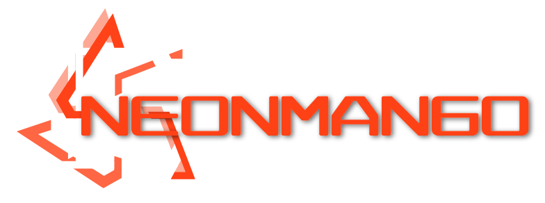

# Neon Mango Game Engine    
[English](README_en-US.md) • [简体中文](README_zh-CN.md)

Neon Mango is a free and open source lightweight game development framework, led by Beanflame.
It is expected that all mainstream computer platforms (OSX, Windows and Linux) can support the operation.

[Install](#Install) • [Support](#Support) • [License](#License)

## Install

- [x] Visual Studio 2022
- [x] [.net 6.0](https://get.dot.net)

## Support
- environment platform
    - [x] Windows 
    - [x] Linux
    - [x] OSX

## License
* [MIT License](./LICENSE)
