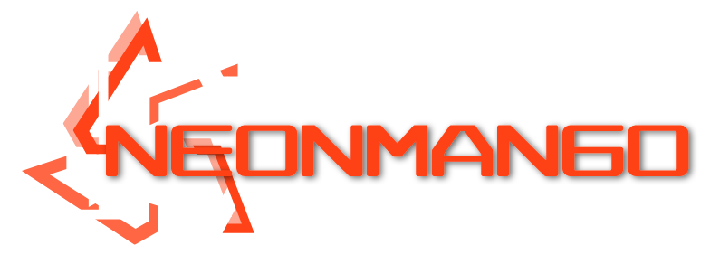

# 霓虹芒果
[English](README_en-US.md) • [简体中文](README_zh-CN.md)

霓虹芒果是一门免费开源的轻量级游戏开发框架，由豆焰主导开发工作。
期望在所有主流电脑平台（OSX、Windows和Linux）都能支持运行。

[安装](#安装) • [支持](#支持) • [许可](#许可)

## 安装
- [x] Visual Studio
- [x] [.net 6.0](https://get.dot.net)

## 支持
- 环境平台
    - [x] Windows 
    - [x] Linux
    - [x] OSX

## 许可
* [MIT License](./LICENSE)
